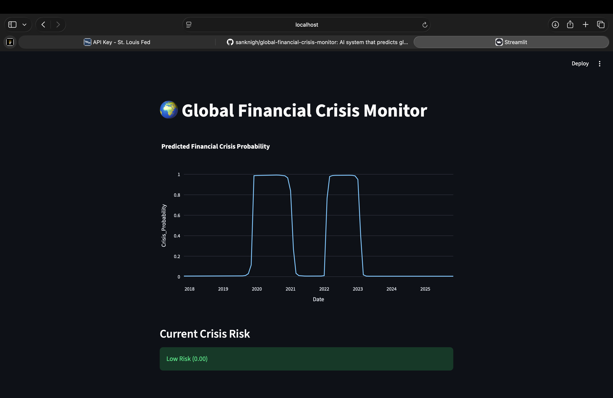

# 🌍 Global Financial Crisis Monitor

## Dashboard Preview

An AI-powered system that predicts global financial crises using macroeconomic indicators and deep learning.

---

## Features

- Macroeconomic data from FRED API
- LSTM deep learning crisis prediction
- Financial crisis probability visualization
- Interactive Streamlit dashboard

---

## Project Structure

global_crisis_prediction

data → macroeconomic dataset  
models → trained model  
src → machine learning pipeline  
dashboard → Streamlit dashboard  
config.py → configuration  

---

## Run the Project

Activate environment: