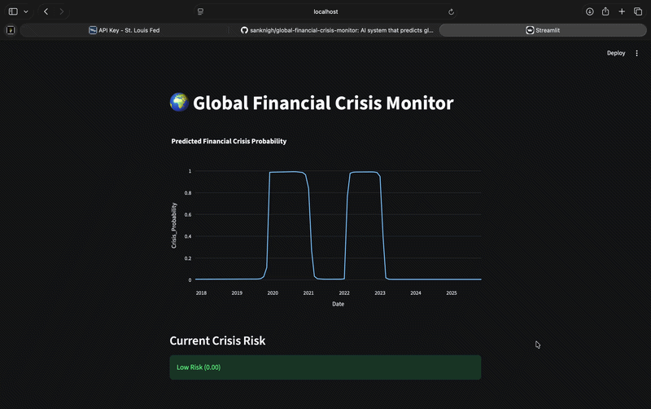

# 🌍 Global Financial Crisis Monitor

## Dashboard Preview




An AI-powered system that predicts global financial crises using macroeconomic indicators and deep learning.

---

## Features

- Macroeconomic data from FRED API
- LSTM deep learning crisis prediction
- Financial crisis probability visualization
- Interactive Streamlit dashboard

---

## Project Structure

```
global_crisis_prediction
│
├── data/        → macroeconomic dataset
├── models/      → trained model
├── src/         → machine learning pipeline
│   ├── dataset.py
│   ├── model.py
│   ├── train.py
│   ├── visualize.py
│   ├── evaluate.py
│   ├── utils.py
│   └── data_pipeline.py
│
├── dashboard/
│   └── app.py   → Streamlit dashboard
│
├── config.py
├── requirements.txt
└── README.md
```

---

## Run the Project

### 1 Activate Environment

```
source .venv/bin/activate
```

### 2 Train the Model

```
python -m src.train
```

### 3 Run the Dashboard

```
streamlit run dashboard/app.py
```

---

## Technologies Used

- Python
- PyTorch
- Streamlit
- Plotly
- FRED API
- Time Series Analysis
- Deep Learning (LSTM)

---

## Author

Sangeeth Kumar